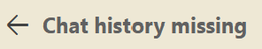
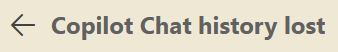
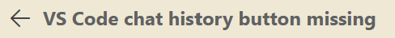
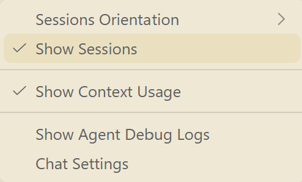

# About

This is the repository for our official website, built with our custom Markdown-powered full-stack CMS.

We are the smart **Stupig**s!

Learn more about us at our official website [stupig.tv](https://www.stupig.tv).

# Deployment

- Wire up your MySQL and Redis instance
- Wire up your EMQX WebSocket endpoint like `http://127.0.0.1:8083` to `<your-domain>/mqtt`
- Add a scheduled task to run the storage cleanup: 1panel 计划任务 → 类型选「容器内执行」→
  容器 `stupig-tv` → 命令 `cd /app && node .output/server/maintenance/cleanup.mjs --delete --grace-hours=168`
  （`cd /app` 不能省：配置加载以 cwd 为基准找 `config/*.yaml`。先用不带 `--delete`
  的同一命令跑一次，确认报告内容符合预期再开删）
- Set `client_max_body_size 2m;` for your gateway safety

# This is why you should always update your VSCode without reading the changelog

`POV: you click "update" in your VSCode as usual.`

the following 2 hrs:

occasionally:

you:

