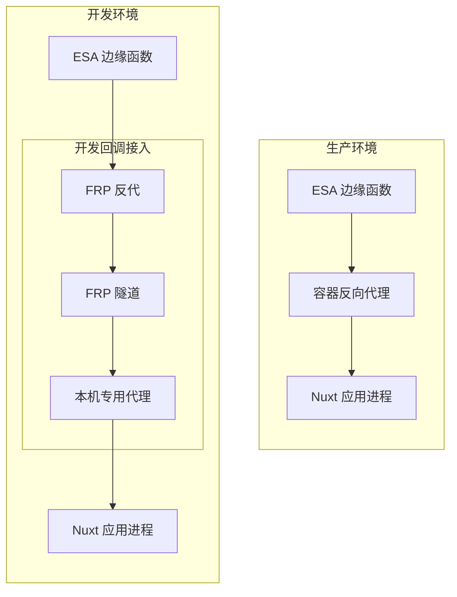

# TMP：授权回调链路对照

独立对照图、开发接入分组及 FRP 反代节点均已被 [SID#0.1.DESIGN](DESIGN.md) 采用。此处保留试稿，现行节点名称和排列以权威文档为准。

```mermaid
flowchart TB
  subgraph Production[生产环境]
    direction TB
    ProdEdge[ESA 边缘函数] --> ProdProxy[容器反向代理]
    ProdProxy --> ProdApp[Nuxt 应用进程]
  end

  subgraph Development[开发环境]
    direction TB
    DevEdge[ESA 边缘函数]
    subgraph DevAccess[开发回调接入]
      direction TB
      DevReverseProxy[FRP 反代] --> DevTunnel[FRP 隧道]
      DevTunnel --> DevProxy[本机专用代理]
    end
    DevEdge --> DevReverseProxy
    DevProxy --> DevApp[Nuxt 应用进程]
  end
```

两条链路分别表示对应环境的授权回调请求，目标均为 `POST /api/content/authorize`。开发环境的 FRP 反代是公网 HTTPS 入口，本机专用代理只转发此接口。
